my_render <- function(input, encoding) {
rmarkdown::render(input, clean = FALSE, encoding = encoding)
}

---
#' output:
#'   html_document:
#'     keep_md: TRUE
knit: my_render
---
<title>{Network Analysis Tutorial \ With Applications in \R }</title>

# Network Analysis Tutorial  
#### With Applications in <span class="roman"><tt>R</tt>  </span>

### Bruce A. Desmarais
#### Pennsylvania State University

### <a name="tth_sEc1">1</a> Introduction

*   Provide a broad introduction to many concepts/methods (nothing in depth)  

*   Present technical intuition and some essential math (no derivations)  

*   Comments describing functions generally (see help for explanations of all options)  

### <a name="tth_sEc2">2</a> Introduction to R

#### <a name="tth_sEc2.1">2.1</a> Programming in R: First Steps

*   <span class="roman"><tt>R</tt>  </span>is a Command-line interpreted programming language  

*   Commands executed sequentially by return (i.e., `enter') or separated by ';'  

*   Script files are formatted in plain text files (e.g. UTF-8) with extension ".R"  

*   Comment heavily using '#'  


```r
# In R, functions are executed as '<function.name>(<input>)'
# <input> is a comma-separated list of arguments
# The exception is the 'print()' function, which can 
# be executed by typing the name of the object to 
# print and hitting enter
# Try
print(x='Hello World')
```

```
## [1] "Hello World"
```

```r
# x is the only argument
```


#### <a name="tth_sEc2.2">2.2</a> Objects: Vectors and Matrices

*   In <span class="roman"><tt>R</tt>  </span>everything is an object.  

*   <span class="roman"><tt>R</tt>  </span>environment - collection of objects accessible to <span class="roman"><tt>R</tt>  </span>in RAM  

*   Vector - column of nubmers, characters, logicals (T/F)  

```r
# Vectors contain data of the same type
# Create a character vector
char_vec <- c('a','b','c')
# Look at it
char_vec
```

```
## [1] "a" "b" "c"
```

```r
# Create a numeric vector
num_vec <- numeric(5)
num_vec
```

```
## [1] 0 0 0 0 0
```

```r
# Change Values
num_vec[1] <- 4
num_vec[2:4] <- c(3,2,1) 
num_vec
```

```
## [1] 4 3 2 1 0
```

```r
num_vec[5] <- '5'
num_vec
```

```
## [1] "4" "3" "2" "1" "5"
```

```r
# Reference all but 3
num_vec[-3]
```

```
## [1] "4" "3" "1" "5"
```

```r
num_vec
```

```
## [1] "4" "3" "2" "1" "5"
```

*   Matrix  


```r
# Create a matrix
MyMat <- matrix(1:25,nrow=5,ncol=5)
MyMat
```

```
##      [,1] [,2] [,3] [,4] [,5]
## [1,]    1    6   11   16   21
## [2,]    2    7   12   17   22
## [3,]    3    8   13   18   23
## [4,]    4    9   14   19   24
## [5,]    5   10   15   20   25
```

```r
# Access (or change) a cell
MyMat[1,3] 
```

```
## [1] 11
```

```r
MyMat[2,4] <- 200 
MyMat[2,4]
```

```
## [1] 200
```

```r
# Rows then columns
MyMat[1,]
```

```
## [1]  1  6 11 16 21
```

```r
MyMat[,3] <- c(1,1,1,1,1)
MyMat[,3]
```

```
## [1] 1 1 1 1 1
```

```r
MyMat
```

```
##      [,1] [,2] [,3] [,4] [,5]
## [1,]    1    6    1   16   21
## [2,]    2    7    1  200   22
## [3,]    3    8    1   18   23
## [4,]    4    9    1   19   24
## [5,]    5   10    1   20   25
```

```r
# Multiple rows/columns and negation
MyMat[1:3,-c(1:3)]
```

```
##      [,1] [,2]
## [1,]   16   21
## [2,]  200   22
## [3,]   18   23
```

```r
# The matrix (shortcut for network objects)
MyMat[,]
```

```
##      [,1] [,2] [,3] [,4] [,5]
## [1,]    1    6    1   16   21
## [2,]    2    7    1  200   22
## [3,]    3    8    1   18   23
## [4,]    4    9    1   19   24
## [5,]    5   10    1   20   25
```

#### <a name="tth_sEc2.3">2.3</a> Objects: Data Frames

*   Data Frames can hold columns of different types  


```r
# A Data Frame is the conventional object type for a dataset
## Create a data frame containing numbers and a character vector
## Construct a letter vector
let_vec <- c('a','b','c','d','e')

## Combine various objects into a data frame
dat <- data.frame(MyMat, num_vec,let_vec, stringsAsFactors=F)

## Create/override variable names
names(dat) <- c("mm1","mm2","mm3","mm4","mm5","nv","lv")

# Variables can be accessed with '/pre>
dat$lv
```

```
## [1] "a" "b" "c" "d" "e"
```

```r
# Or with matrix-type column indexing
dat[,7]
```

```
## [1] "a" "b" "c" "d" "e"
```

#### <a name="tth_sEc2.4">2.4</a> R Packages


```r
# Use install.packages() to install
# library() or require() to use the package
# install.packages('statnet') 
# install.packages('igraph') 
# install.packages('GGally') 
library(statnet,quietly=T)

# R is OPEN SOURCE,  SO LOOK AT THE CODE !!!
network.size
```

```
## function (x) 
## {
##     if (!is.network(x)) 
##         stop("network.size requires an argument of class network.\\n")
##     else get.network.attribute(x, "n")
## }
## <environment: namespace:network>
```

```r
# And give credit to the authors
citation('statnet')
```

```
## 
## `statnet` is part of the Statnet suite of packages.  If you are
## using the `statnet` package for research that will be published,
## we request that you acknowledge this by citing the following. For
## BibTeX format, use toBibtex(citation("statnet")).
## 
## Handcock M, Hunter D, Butts C, Goodreau S, Krivitsky P,
## Bender-deMoll S and Morris M (2016). _statnet: Software Tools for
## the Statistical Analysis of Network Data_. The Statnet Project
## (<URL: http://www.statnet.org>). R package version 2016.9, <URL:
## CRAN.R-project.org/package=statnet>.
## 
## Handcock M, Hunter D, Butts C, Goodreau S and Morris M (2008).
## "statnet: Software Tools for the Representation, Visualization,
## Analysis and Simulation of Network Data." _Journal of Statistical
## Software_, *24*(1), pp. 1-11. <URL:
## http://www.jstatsoft.org/v24/i01>.
## 
## We have invested a lot of time and effort in creating the Statnet
## suite of packages for use by other researchers. Please cite it in
## all papers where it is used. The package statnet is made
## distributed under the terms of the license: GPL-3 + file LICENSE
## To see these entries in BibTeX format, use 'print(<citation>,
## bibtex=TRUE)', 'toBibtex(.)', or set
## 'options(citation.bibtex.max=999)'.
```

```r
# BibTeX Users
toBibtex(citation("statnet"))
```

```
## @Manual{,
##   author = {Mark S. Handcock and David R. Hunter and Carter T. Butts and Steven M. Goodreau and Pavel N. Krivitsky and Skye Bender-deMoll and Martina Morris},
##   title = {statnet: Software Tools for the Statistical Analysis of Network Data},
##   organization = {The Statnet Project (\url{http://www.statnet.org})},
##   year = {2016},
##   note = {R package version 2016.9},
##   url = {CRAN.R-project.org/package=statnet},
## }
## 
## @Article{,
##   title = {statnet: Software Tools for the Representation, Visualization, Analysis and Simulation of Network Data},
##   author = {Mark S. Handcock and David R. Hunter and Carter T. Butts and Steven M. Goodreau and Martina Morris},
##   journal = {Journal of Statistical Software},
##   year = {2008},
##   volume = {24},
##   number = {1},
##   pages = {1--11},
##   url = {http://www.jstatsoft.org/v24/i01},
## }
```

#### <a name="tth_sEc2.5">2.5</a> Interactions with the Hard Drive

```r
# Saving dat as a .csv
write.csv(dat,'dat.csv', row.names=F)

# Loading it as such
dat2 <- read.csv('dat.csv',stringsAsFactors=F)

# Save to RData file and load
save(list=c("dat2","dat"),file="dat_and_dat2.RData")
load("dat_and_dat2.RData")
# understand that objects in the loaded objects will overwrite
```

#### <a name="tth_sEc2.6">2.6</a> R can help

```r
# When you know the function name exactly
help("evcent")
# or
?evcent

# Find help files containing a word
help.search("eigenvector")
```

R help files contain

*   function usage arguments  

*   detailed description  

*   values (objects) returned  

*   links to related functions  

*   references on the methods  

*   error-free examples  

### <a name="tth_sEc3">3</a> Introduction to Networks

#### <a name="tth_sEc3.1">3.1</a> Network Terminology and the Basics

*   Units in the network: **<font color="#FF0000">Nodes, actors, or vertices</font>**  

*   Relationships between nodes: **<font color="#FF0000">edges, links, or ties</font>**  

*   Pairs of actors: **<font color="#FF0000">Dyads</font>**  

*   Direction: **<font color="#FF0000">Directed vs. Undirected (digraph vs. graph)</font>**  

*   Tie value: **<font color="#FF0000">Dichotomous/Binary, Valued/Weighted</font>**  

*   Ties to Self: **<font color="#FF0000">Loops</font>**  

#### <a name="tth_sEc3.4">3.2</a> Network and Network Data Types

*   Many Modes with unconnected nodes: **<font color="#FF0000">Bi/Multipartite</font>**
    *   Affiliation Networks  

    *   Association/correlation Networks  

    *   **<font color="#FF0000">Beware of Collapsed Modes!</font>**  

*   Many relations among nodes: **<font color="#FF0000">Multiplex</font>**  

*   Data types
    *   Have all the data: **<font color="#FF0000">Network Census</font>**  

    *   Have links data from a sample of nodes: **<font color="#FF0000">Ego Network</font>**  

    *   Sample along links starting with Ego: **<font color="#FF0000">link tracing, snowball, respondent-driven</font>**  

#### <a name="tth_sEc3.2">3.3</a> Network Data

*   Vertex-level Data: **<font color="#FF0000">Vertex attributes (_n_ rows and _k_ columns)</font>**  

*   Adjacency Matrix **<font color="#FF0000">Data for each relation (_n_ by _n_) matrix</font>**  

*   Edgelist **<font color="#FF0000">Data for each edge (_e_ by _p_) matrix. p typically two---sender & receiver</font>**  


```r
# Read in adjacency matrices
## read.csv creates a data frame object from a CSV file
## Need to indicate that there's no header row in the CSV
advice <- read.csv("Advice.csv", header=F)

reportsto <- read.csv("ReportsTo.csv", header = F)

# Read in vertex attribute data
attributes <- read.csv("KrackhardtVLD.csv")
```

#### <a name="tth_sEc3.2">3.4.1</a>  Creating Network Objects: Managers in a "Hi-Tech" Firm

```r
# Read in the library for network analysis
library(network,quietly=T)

# Use the advice network dataset to create network object
adviceNet <- network(advice)

# Add the vertex attributes into the network
set.vertex.attribute(adviceNet,names(attributes),attributes)

# Add the organizational chart as a network variable
set.network.attribute(adviceNet,"reportsto",reportsto)

# Simple plot
## Set random number seed so the plot is replicable
set.seed(5)
## create vertex labels
vertex.labels <- get.vertex.attribute(adviceNet,"Level")
## create edge colors
edge.colors <- rgb(150,150,150,100,maxColorValue=255)
## Now plot
## Plot the network
plot(adviceNet,              # network object
     displaylabels=T,        # label nodes
     label=vertex.labels,    # label vector
     label.cex=1,            # size of the vertex lables
     vertex.cex=3,           # vertex size
     edge.col=edge.colors,   # edge color vector
     label.pos=5,            # position labels in the center
     vertex.col="lightblue") # set the vertex color
```

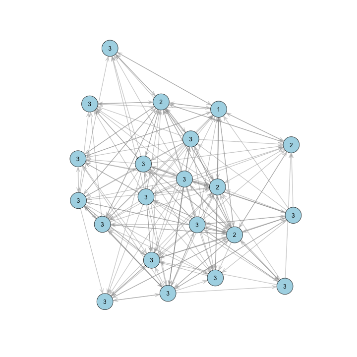

```r
# check out all the options with ?plot.network

# gg-verse alternative based on plot.network/sna:::gplot
library(GGally)
set.seed(5)
ggnet(adviceNet,
      size = 11,
      color="white",
      segment.color=edge.colors,
      label=vertex.labels)
```

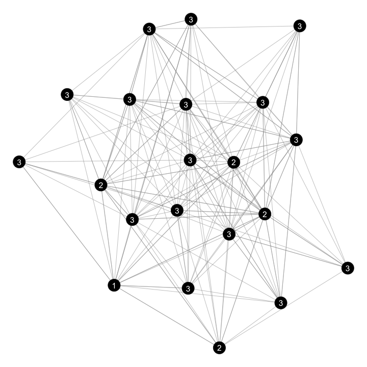

#### <a name="tth_sEc3.2">3.4.2</a> Creating Network Objects: Defense Pacts (edgelist) (2000)


```r
# Read in vertex dataset
allyV <- read.csv("allyVLD.csv",stringsAsFactors=F)

# Read in edgelist
allyEL <- read.csv("allyEL.csv", stringsAsFactors=F)

# Read in contiguity
contig <- read.csv("contiguity.csv",stringsAsFactors=F,row.names=1)

require(network)
# (1) Initialize network
# store number of vertices
n <- nrow(allyV)
AllyNet <- network.initialize(n,dir=F)

# (2) Set vertex labels
network.vertex.names(AllyNet)  <- allyV$stateabb

# (3) Add in the edges
# Note, edgelist must match vertex labels
AllyNet[as.matrix(allyEL)]  <- 1

# (4) Store country code attribute
set.vertex.attribute(x=AllyNet, 			# Network in which to store
			"ccode",			# What to name the attribute
			allyV$ccode)			# Values to put in

# (5) Store year attribute
set.vertex.attribute(AllyNet,"created",allyV$styear)

# (6) Store network attribute
set.network.attribute(AllyNet,"contiguous",as.matrix(contig))

# Simple plot
plot(AllyNet,displaylabels=T,label.cex=.5,edge.col=rgb(150,150,150,100,maxColorValue=255))
```

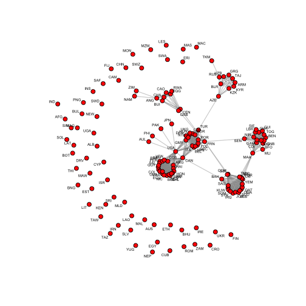

```r
# check out all the options with ?plot.network
```

### <a name="tth_sEc5">4</a> The Individual Level: Actor Position Analysis

#### <a name="tth_sEc3.5">4.1</a> Connectedness: Degree Centrality

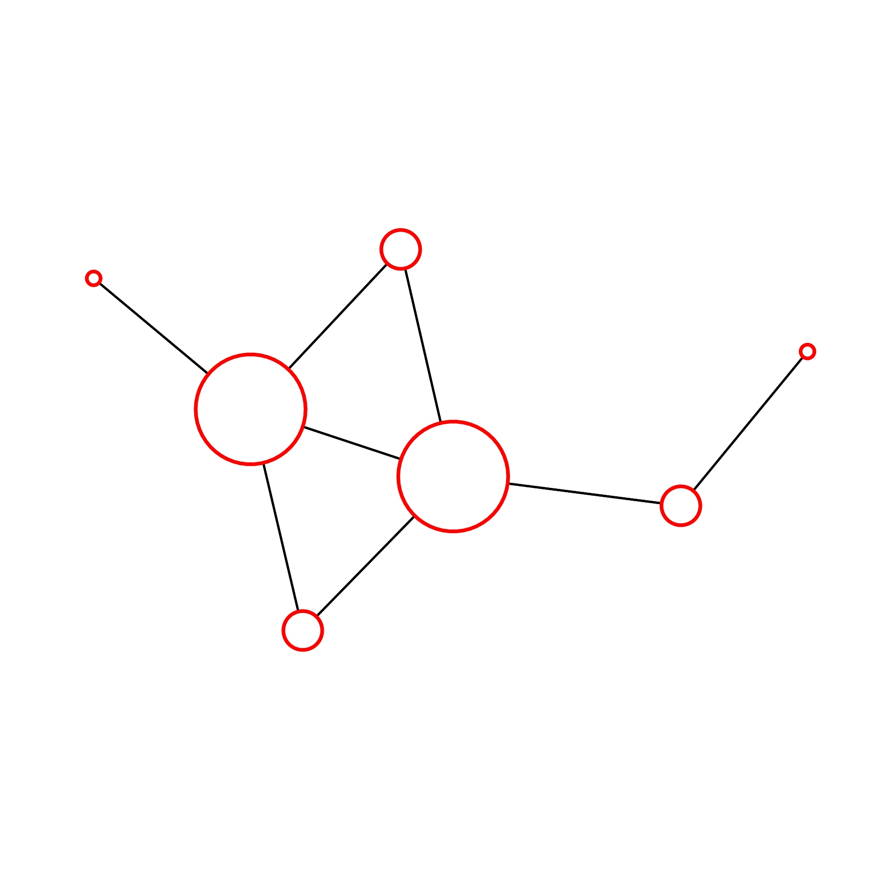

```r
require(sna)
# (in-) Degree Centrality is the number of in-connections by node
dc <- degree(adviceNet, cmode="indegree")

# Store in vertex level data frame
attributes$dc <- dc

# Plot degree centrality against age
## Make a simple scatter plot
par(cex=2,las=1)
plot(attributes$Tenure,attributes$dc)
## Add a trend (i.e., regression) line
abline(lm(attributes$dc ~ attributes$Tenure))
```

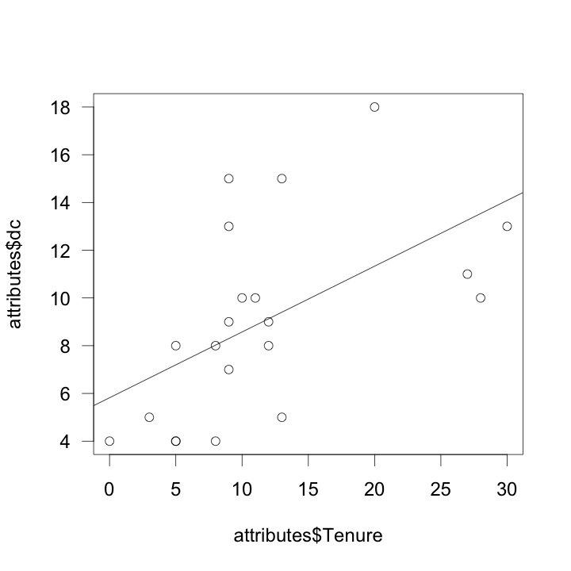

```r
# Plot network with node size proportional to Degree Centrality
## First normalize degree 
ndc <- dc/max(dc)
## Set random number seed so the plot is replicable
set.seed(5)
## create vertex labels
vertex.labels <- get.vertex.attribute(adviceNet,"Level")
## create edge colors
edge.colors <- rgb(150,150,150,100,maxColorValue=255)
## Now plot
plot(adviceNet,              # network object
     displaylabels=T,        # label nodes
     label=vertex.labels,    # label vector
     vertex.cex=3*ndc,       # vertex size vector
     label.cex=1,            # size of the vertex lables
     edge.col=edge.colors,   # edge color vector
     label.pos=5,            # position labels in the center
     vertex.col="lightblue") # set the vertex color
```

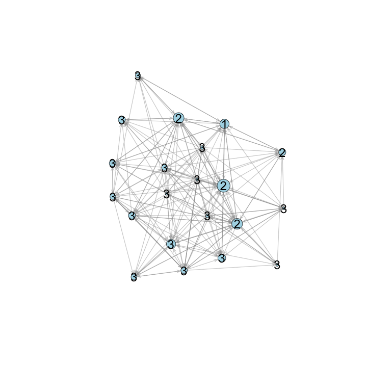

#### <a name="tth_sEc3.6">4.2</a> Connectedness: Eigenvector Centrality

<center>**x** = λ<sup>-1</sup>A**x**</center>

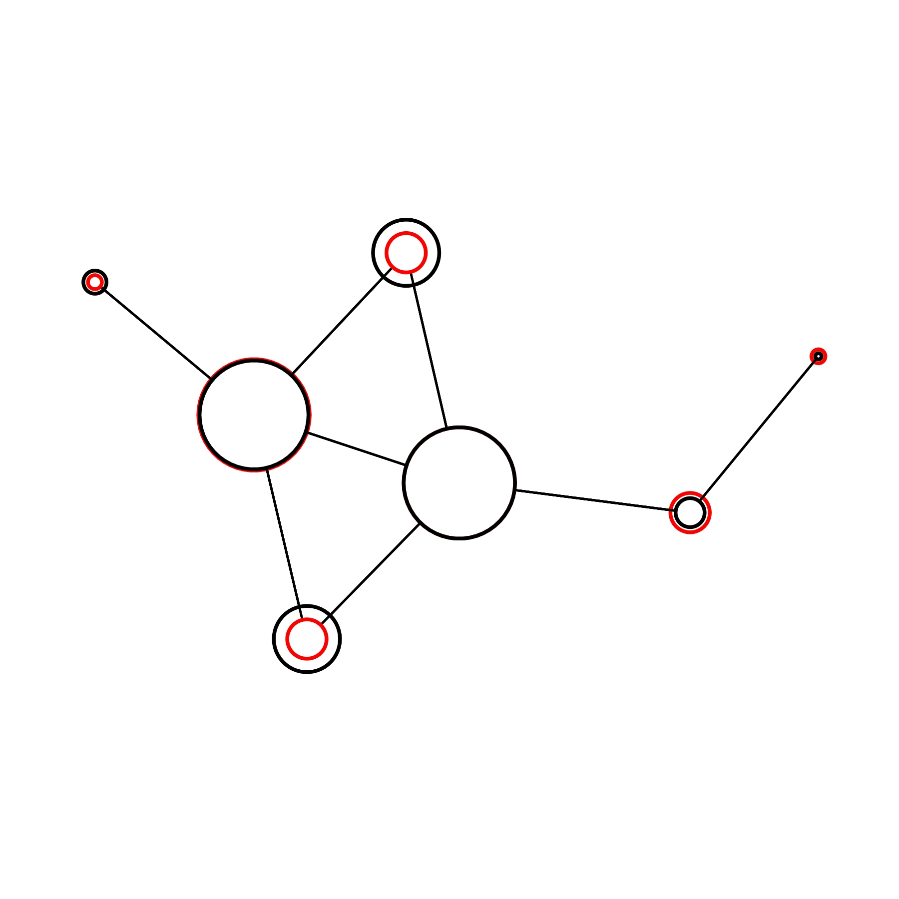


```r
# Eigenvector Centrality Recursively Considers Neighbors' Centrality
ec <- evcent(adviceNet)

# Store in vertex level data frame
attributes$ec <- ec

# Plot eigenvector centrality against age
## Make a simple scatter plot
par(cex=2,las=1)
plot(attributes$Tenure,attributes$ec)
## Add a trend (i.e., regression) line
abline(lm(attributes$ec ~ attributes$Tenure))
```

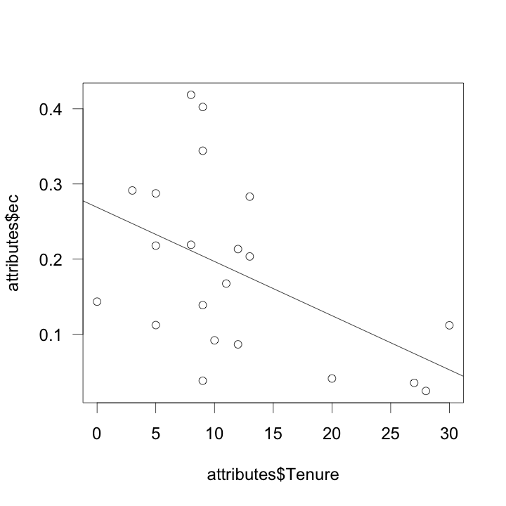

```r
# Plot network with node size proportional to eigenvector centrality
## First normalize
nec <- ec/max(ec)
## Set random number seed so the plot is replicable
set.seed(5)
## Now plot
plot(adviceNet,displaylabels=T,label=get.vertex.attribute(adviceNet,"Level"),vertex.cex=3*nec,label.cex=1,edge.col=rgb(150,150,150,100,maxColorValue=255),label.pos=5,vertex.col="lightblue")
```

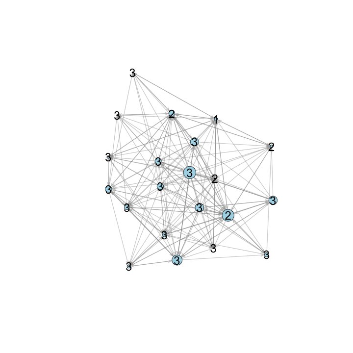

#### <a name="tth_sEc3.7">4.3</a> Connectedness: Betweenness Centrality

```r
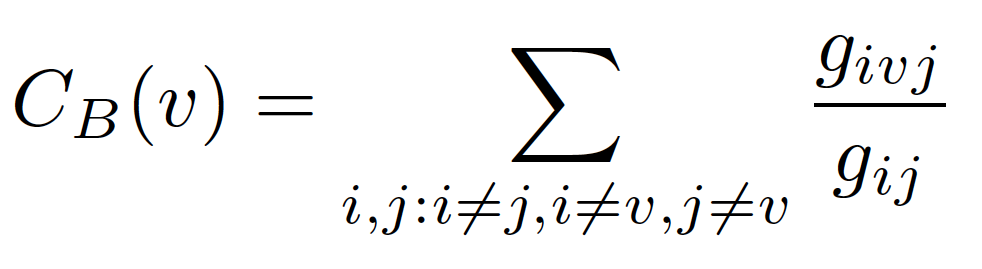
```


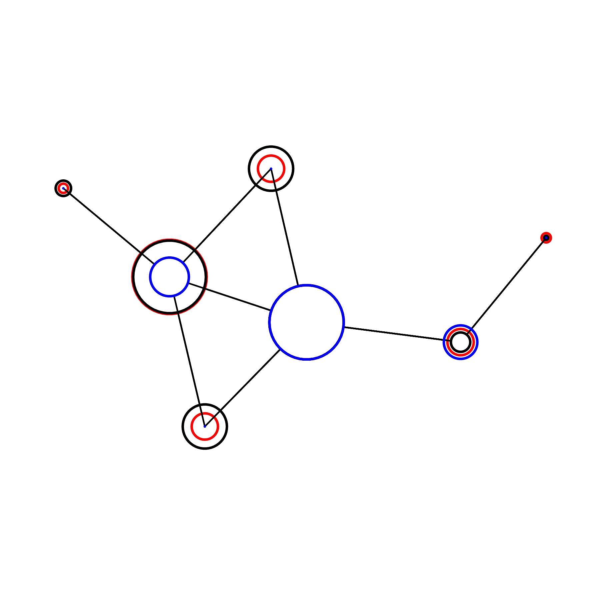


```r
# Betweenness Centrality Considers unlikely connections
# Proportion of shortest paths that pass through a vertex
bc <- betweenness(adviceNet,rescale=T)

# Store in vertex level data frame
attributes$bc <- bc

# Plot eigenvector centrality against age
## Make a simple scatter plot
par(cex=2,las=1)
plot(attributes$Tenure,attributes$bc)
## Add a trend (i.e., regression) line
abline(lm(attributes$bc ~ attributes$Tenure))
```

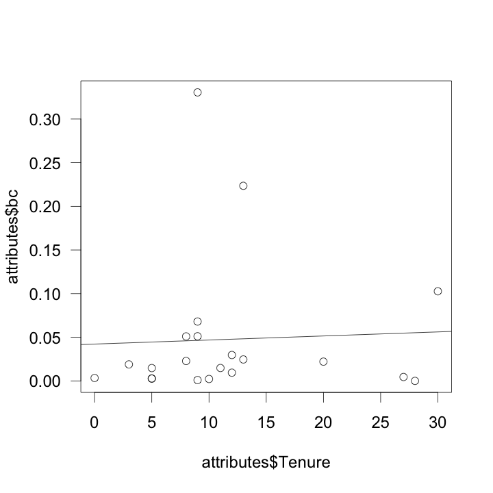

```r
# Plot network with node size proportional to betweenness centrality
## First normalize
nbc <- bc/max(bc)
## Set random number seed so the plot is replicable
set.seed(5)
## Now plot
plot(adviceNet,displaylabels=T,label=get.vertex.attribute(adviceNet,"Level"),vertex.cex=3*nbc,label.cex=1,edge.col=rgb(150,150,150,100,maxColorValue=255),label.pos=5,vertex.col="lightblue")
```

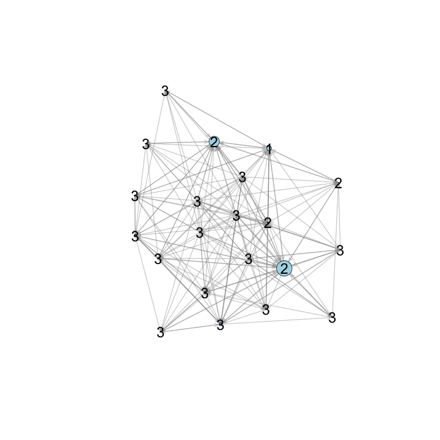

#### <a name="tth_sEc3.8">4.4</a> Comparing Centrality Measures


```r
# DC vs. EC
par(cex=2,las=1)
plot(dc,ec)
```

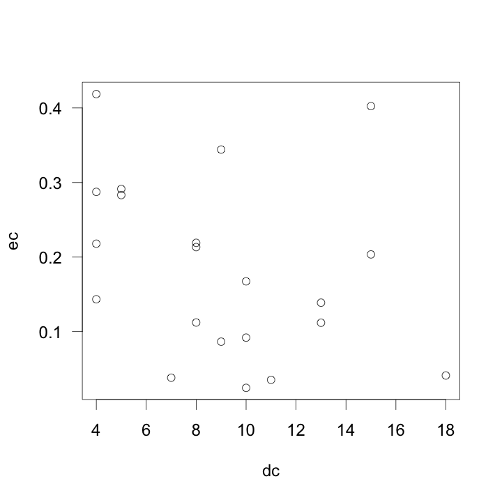

```r
# DC vs. BC
par(cex=2,las=1)
plot(dc,bc)
```

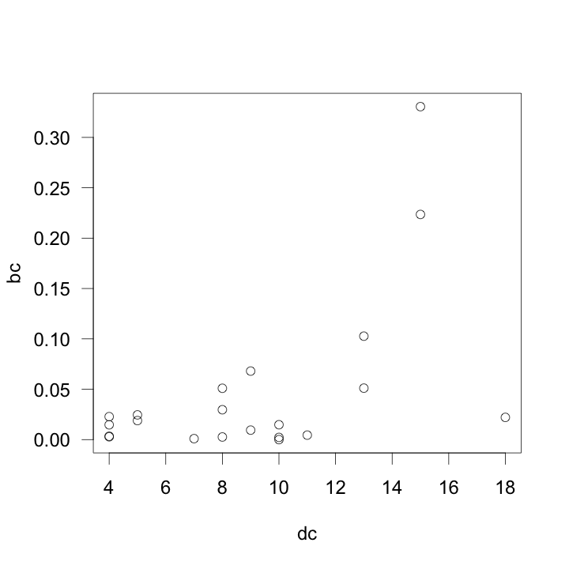

```r
# BC vs. EC
par(cex=2,las=1)
plot(bc,ec)
```

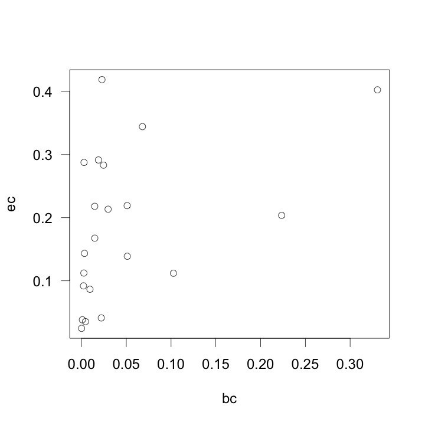

```r
# Correlations among all of them
cor(cbind(ec,bc,dc))
```

```
##           ec        bc         dc
## ec  1.000000 0.4320920 -0.3164510
## bc  0.432092 1.0000000  0.5436799
## dc -0.316451 0.5436799  1.0000000
```

#### <a name="tth_sEc3.5">4.5</a> Embeddedness: Clustering Coefficient

<div class="p">Clustering coefficient is the proportion of potential ties among a node's neightbors that exist.</div>

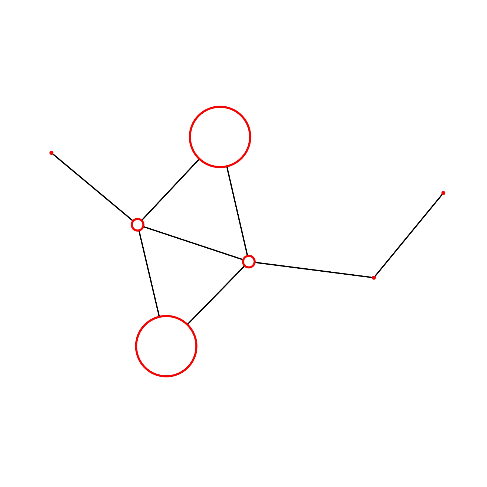


```r
# Read in library for clustering coefficient
require(igraph,quietly=T)
```

```
## Warning: package 'igraph' was built under R version 3.4.4
```

```
## 
## Attaching package: 'igraph'
```

```
## The following objects are masked from 'package:sna':
## 
##     betweenness, bonpow, closeness, components, degree,
##     dyad.census, evcent, hierarchy, is.connected, neighborhood,
##     triad.census
```

```
## The following objects are masked from 'package:network':
## 
##     %c%, %s%, add.edges, add.vertices, delete.edges,
##     delete.vertices, get.edge.attribute, get.edges,
##     get.vertex.attribute, is.bipartite, is.directed,
##     list.edge.attributes, list.vertex.attributes,
##     set.edge.attribute, set.vertex.attribute
```

```
## The following objects are masked from 'package:stats':
## 
##     decompose, spectrum
```

```
## The following object is masked from 'package:base':
## 
##     union
```

```r
# Compute local transitivity, i.e., the clustering clef
anet <- graph.adjacency(adviceNet[,])
cc <- transitivity(anet,type="local")

# Store in data frame
attributes$cc <- cc
attributes
```

```
##    Age Tenure Level Department dc         ec           bc        cc
## 1   33      9     3          4 13 0.13887187 0.0511034401 0.5263158
## 2   42     20     2          4 18 0.04122224 0.0220658524 0.5666667
## 3   40     13     3          2  5 0.28317710 0.0245530182 0.5105263
## 4   33      8     3          4  8 0.21911327 0.0509618222 0.3473684
## 5   32      3     3          2  5 0.29140287 0.0188794477 0.4210526
## 6   59     28     3          1 10 0.02466730 0.0000000000 0.6909091
## 7   55     30     1          0 13 0.11196954 0.1026936921 0.3047619
## 8   34     11     3          1 10 0.16751801 0.0147754765 0.4967320
## 9   62      5     3          2  4 0.21796754 0.0146987667 0.5514706
## 10  37      9     3          3  9 0.34421295 0.0680179383 0.3162055
## 11  46     27     3          3 11 0.03538648 0.0044550658 0.7252747
## 12  34      9     3          1  7 0.03823355 0.0009441199 0.4722222
## 13  48      0     3          2  4 0.14344220 0.0033191715 0.5555556
## 14  43     10     2          2 10 0.09198919 0.0021891780 0.4835165
## 15  40      8     3          2  4 0.41860823 0.0227975453 0.4528986
## 16  27      5     3          4  8 0.11228627 0.0026022305 0.4848485
## 17  30     12     3          1  9 0.08660158 0.0094116953 0.4945055
## 18  33      9     2          3 15 0.40245199 0.3305452292 0.2016129
## 19  32      5     3          2  4 0.28747761 0.0028028560 0.4571429
## 20  38     12     3          2  8 0.21341504 0.0296630672 0.4842105
## 21  36     13     2          1 15 0.20359254 0.2235203871 0.2430769
```

```r
# Remove igraph before using statnet functions
detach(package:igraph)

# Plot network with node size proportional to clustering clef
## First normalize
ncc <- cc/max(cc)
## Set random number seed so the plot is replicable
set.seed(5)
## Now plot
plot(adviceNet,displaylabels=T,label=get.vertex.attribute(adviceNet,"Level"),vertex.cex=3*ncc,label.cex=1,edge.col=rgb(150,150,150,100,maxColorValue=255),label.pos=5,vertex.col="lightblue")
```

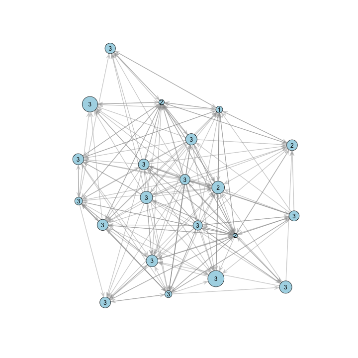

```r
# Correlations among all of them
cor(cbind(ec,bc,dc,cc))
```

```
##            ec         bc         dc         cc
## ec  1.0000000  0.4320920 -0.3164510 -0.5872217
## bc  0.4320920  1.0000000  0.5436799 -0.7536546
## dc -0.3164510  0.5436799  1.0000000 -0.2204078
## cc -0.5872217 -0.7536546 -0.2204078  1.0000000
```

### <a name="tth_sEc5">5</a> Group-Level Analysis: Communities and Clusters

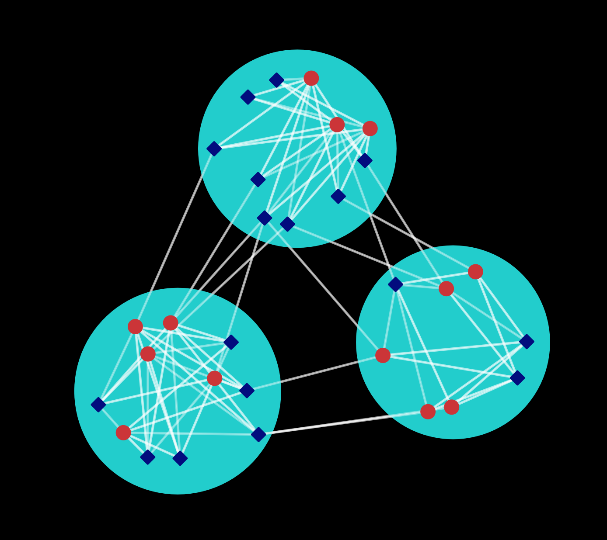

#### <a name="tth_sEc5.1">5.1</a> Clustering by Structural Equivalence

```r
# Blockmodeling is the Classical SNA Approach
# Goal is to group nodes based on structural equivalence

## Create clusters based on structural equivalence
eclusts <- equiv.clust(adviceNet)

## First check out a dendrogram to eyeball the number of clusters
plot(eclusts,hang=-1)
```

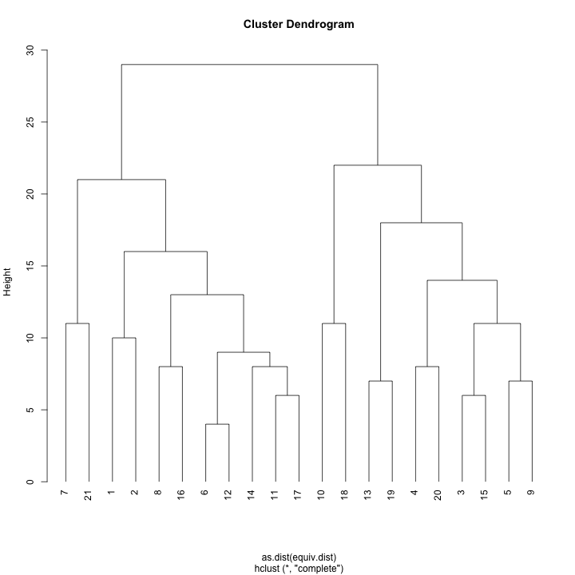

```r
# Run a block model identifying six groups
adviceBlockM <- blockmodel(adviceNet, eclusts, k=6)

# Create block membership vector and colors
## Extract block memberships
bmems <- adviceBlockM$block.membership[adviceBlockM$order.vec]
## Create group colors
colVec <- c("black","white","red","blue","yellow","gray60")
## Assign colors to individual nodes based on block membership
bcols <- colVec[bmems]

set.seed(5)
## Now plot
plot(adviceNet,displaylabels=T,label=get.vertex.attribute(adviceNet,"Level"),vertex.cex=2,label.cex=1,edge.col=rgb(150,150,150,100,maxColorValue=255),label.pos=5,vertex.col=bcols)
```

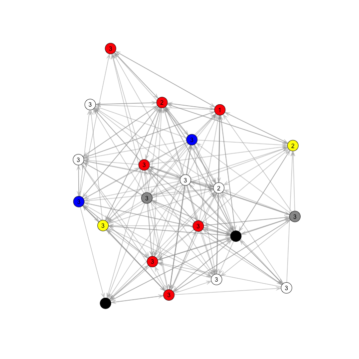

#### <a name="tth_sEc5.2">5.2</a> Clustering Based on Modularity: Community Detection

<center>Modularity = 1/(2m)Σ<sub>ij</sub>[A<sub>ij</sub>-k<sub>i</sub>k<sub>j</sub>/(2m)]**1**(c<sub>i</sub>=c<sub>j</sub>)</center>

*   k is the degree  

*   m is the number of edges in the network  

*   c is the group index  

*   **1** is the indicator function (i.e., are the groups of i and j equal)  

```r
# Modularity-based community detection popular in physics
# Modularity = Dense within communities, sparse across 
library(igraph,quietly=T)
```

```
## Warning: package 'igraph' was built under R version 3.4.4
```

```
## 
## Attaching package: 'igraph'
```

```
## The following objects are masked from 'package:sna':
## 
##     betweenness, bonpow, closeness, components, degree,
##     dyad.census, evcent, hierarchy, is.connected, neighborhood,
##     triad.census
```

```
## The following objects are masked from 'package:network':
## 
##     %c%, %s%, add.edges, add.vertices, delete.edges,
##     delete.vertices, get.edge.attribute, get.edges,
##     get.vertex.attribute, is.bipartite, is.directed,
##     list.edge.attributes, list.vertex.attributes,
##     set.edge.attribute, set.vertex.attribute
```

```
## The following objects are masked from 'package:stats':
## 
##     decompose, spectrum
```

```
## The following object is masked from 'package:base':
## 
##     union
```

```r
# Convert into a graph
anet <- graph.adjacency(adviceNet[,])

## Use semi-greedy splitting and merging
mem <- spinglass.community(anet)$membership

# Check number of communities
max(mem)
```

```
## [1] 2
```

```r
# Get memberships and plot
detach("package:igraph")
bcols <- c("lightblue","yellow")
set.seed(5)
## Now plot
plot(adviceNet,displaylabels=T,label=get.vertex.attribute(adviceNet,"Department"),vertex.cex=2,label.cex=1,edge.col=rgb(150,150,150,100,maxColorValue=255),label.pos=5,vertex.col=bcols)
```

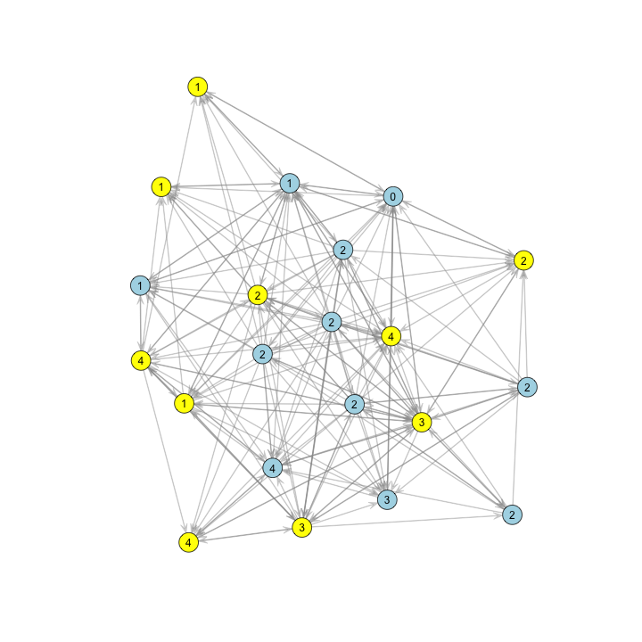

### <a name="tth_sEc6">6</a> Network-Level: Testing Structural Hypotheses

#### <a name="tth_sEc6.1">6.1</a> Introduction

*   Now assume the network is stochastic  

*   We might have hypotheses about the stochastic process
    *   Nodes that are similar are likely to form ties: **<font color="#FF0000">Homophily</font>**  

    *   Directed edges are likely to be reciprocated: **<font color="#FF0000">Reciprocity</font>**  

    *   A friend of a friend is a friend: **<font color="#FF0000">Transitivity</font>**  

#### <a name="tth_sEc6.3">6.3</a> μ=0, the z-test

Suppose **x** is a **large** univariate sample of size n, and T(**x**) is the z-statistic.


Our null is that **X** has finite positive variance and a mean of zero.

<center>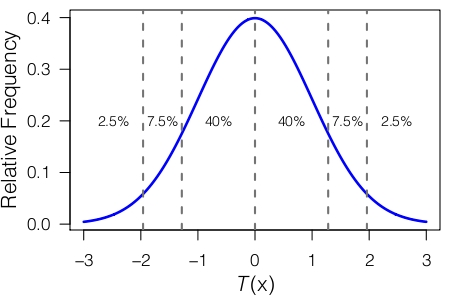</center>

-->

#### <a name="tth_sEc6.3">6.3</a> H<sub>0</sub> for a network...

<center>**Maximum Entropy Null Distribution**  
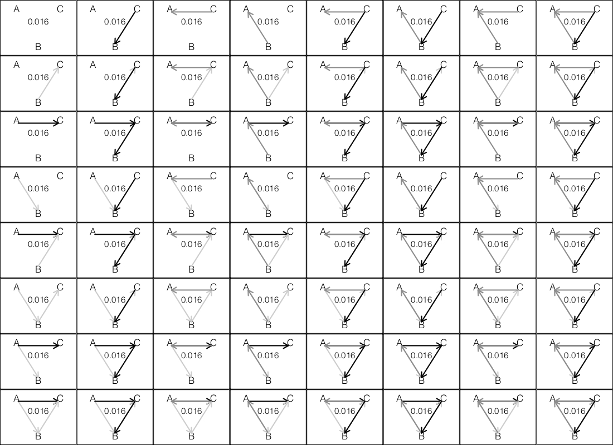  
**Uniform/Equal Probability of Every Network**</center>

#### <a name="tth_sEc6.5">6.5</a> Conditional Uniform Graph Testing: Comparing Observed to Null

```r
# Conditional Uniform Graph Tests
# "CUG" tests allow you to control for features of the observed network in the null
# We should test for transitivity
# gtrans function in sna package measures graph transitivity

# control for the number of edges
cug_gtrans_edges <- cug.test(adviceNet,gtrans,cmode=c("edges"),reps=500)

# Check results
cug_gtrans_edges
```

```
## 
## Univariate Conditional Uniform Graph Test
## 
## Conditioning Method: edges 
## Graph Type: digraph 
## Diagonal Used: FALSE 
## Replications: 500 
## 
## Observed Value: 0.6639785 
## Pr(X>=Obs): 0 
## Pr(X<=Obs): 1
```

```r
# what if we consider the dyad census null?
dyad.census(adviceNet)
```

```
##      Mut Asym Null
## [1,]  45  100   65
```

```r
# control for the number of edges
cug_gtrans_dcensus <- cug.test(adviceNet,gtrans,cmode=c("dyad.census"),reps=500)

cug_gtrans_dcensus
```

```
## 
## Univariate Conditional Uniform Graph Test
## 
## Conditioning Method: dyad.census 
## Graph Type: digraph 
## Diagonal Used: FALSE 
## Replications: 500 
## 
## Observed Value: 0.6639785 
## Pr(X>=Obs): 0 
## Pr(X<=Obs): 1
```

```r
# Now lets look at something else
# Do more experienced managers have higher in-degree centrality?

# function to estimate correlation between in-degree and node attribute
indegCor <-  function(net,attr){
	require(sna)
	cor(degree(net,cmode="indegree"),attr)
}

# See the additional argument in cmode, now controlling for dyad census
cug_indcor_dcensus <- cug.test(adviceNet,indegCor,cmode=c("dyad.census"),reps=500, FUN.args=list(attr = attributes$Tenure))

# Check results
cug_indcor_dcensus
```

```
## 
## Univariate Conditional Uniform Graph Test
## 
## Conditioning Method: dyad.census 
## Graph Type: digraph 
## Diagonal Used: FALSE 
## Replications: 500 
## 
## Observed Value: 0.5493177 
## Pr(X>=Obs): 0.004 
## Pr(X<=Obs): 0.996
```

```r
## Can we incorporate both? 
## Need ERGM for that!
```

### <a name="tth_sEc6">7</a> Independent exercise with the allliance network
*   What are the 5 most central states, according to each centrality measure?  

*   Do community detection and blockmodeling result in substantially different partitions?

*   Is the age of the state significantly correlated with the number of alliance ties?  
